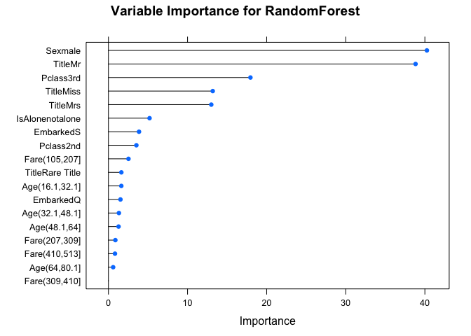
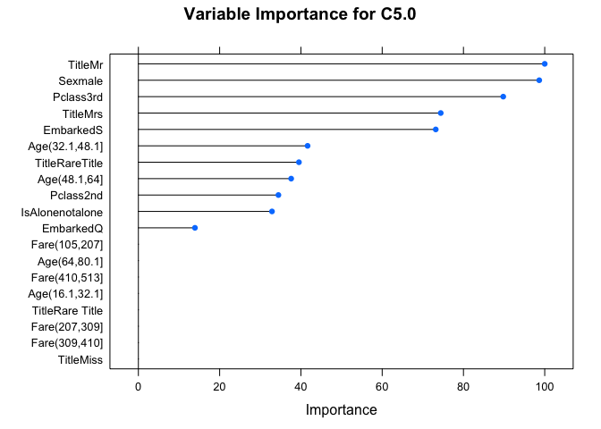
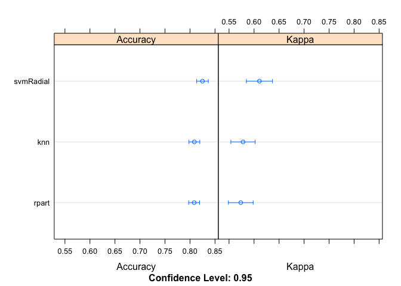
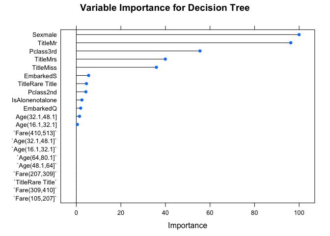
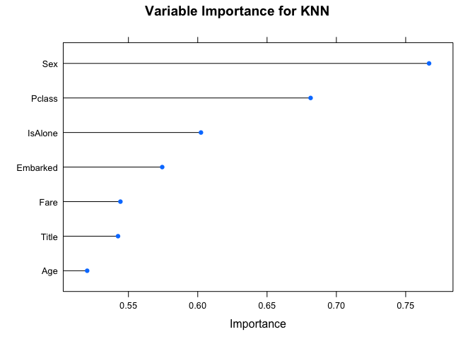
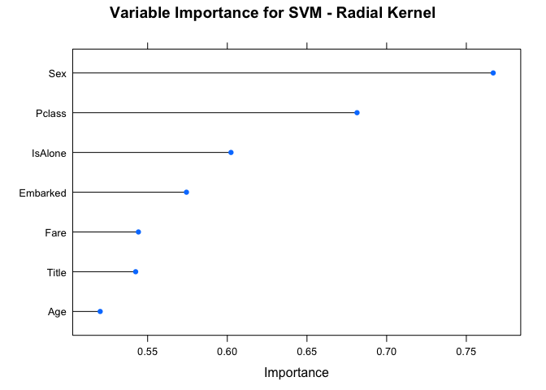

Ensemble Learning in R
================
Kartik Mutya
8/23/2018


> **The idea of ensemble learning is to build a prediction model by combining the strengths of a collection of simpler base models.**

This post implements ensemble learning in R using the Titanic dataset from Kaggle and caret package.

``` r
library(caret) #classification models
library(caretEnsemble)#ensemble methods
library(ggplot2) #plotting
library(dplyr) #data cleaning
```

PREPROCESSING
=============

Finding out the missing values:

``` r
#loading data from the local machine
getwd()
```

    ## [1] "/Users/apple/Google Drive/github/Ensemble"

``` r
setwd("/Users/apple/Google Drive/github/Ensemble/all")
train = read.csv('train.csv')
train_t = subset(train, select = -(Survived))
test = read.csv('test.csv')
main = rbind(train_t, test)
str(main) #Initial structure of main
```

    ## 'data.frame':    1309 obs. of  11 variables:
    ##  $ PassengerId: int  1 2 3 4 5 6 7 8 9 10 ...
    ##  $ Pclass     : int  3 1 3 1 3 3 1 3 3 2 ...
    ##  $ Name       : Factor w/ 1307 levels "Abbing, Mr. Anthony",..: 109 191 358 277 16 559 520 629 417 581 ...
    ##  $ Sex        : Factor w/ 2 levels "female","male": 2 1 1 1 2 2 2 2 1 1 ...
    ##  $ Age        : num  22 38 26 35 35 NA 54 2 27 14 ...
    ##  $ SibSp      : int  1 1 0 1 0 0 0 3 0 1 ...
    ##  $ Parch      : int  0 0 0 0 0 0 0 1 2 0 ...
    ##  $ Ticket     : Factor w/ 929 levels "110152","110413",..: 524 597 670 50 473 276 86 396 345 133 ...
    ##  $ Fare       : num  7.25 71.28 7.92 53.1 8.05 ...
    ##  $ Cabin      : Factor w/ 187 levels "","A10","A14",..: 1 83 1 57 1 1 131 1 1 1 ...
    ##  $ Embarked   : Factor w/ 4 levels "","C","Q","S": 4 2 4 4 4 3 4 4 4 2 ...

-   Compute the no. missing values.

-   Getting rid of few features namely PassengerId, Ticket, Cabin.

``` r
#replace level '' as NA
#converting 0 fare to NA
main$Fare[main$Fare == 0] = NA
#convert factor level '' into NA
names(main)[sapply(main, is.factor)]
```

    ## [1] "Name"     "Sex"      "Ticket"   "Cabin"    "Embarked"

``` r
levels(main$Name)[levels(main$Name) == ''] = NA
levels(main$Sex)[levels(main$Sex) == ''] = NA
levels(main$Ticket)[levels(main$Ticket) == ''] = NA
levels(main$Cabin)[levels(main$Cabin) == ''] = NA
levels(main$Embarked)[levels(main$Embarked) == ''] = NA
#now main has missing values as NA

#tabulate count of missing values in train
sapply(main, function(x){sum(is.na(x))})
```

    ## PassengerId      Pclass        Name         Sex         Age       SibSp 
    ##           0           0           0           0         263           0 
    ##       Parch      Ticket        Fare       Cabin    Embarked 
    ##           0           0          18        1014           2

``` r
#getting rid of few features
main = subset(main, select = -c(PassengerId, Ticket, Cabin))
```

Feature Engineering
-------------------

-   Survived: Convert target variable to factor

-   pclass: Convert pclass to factor as it represents different categories of ticket type

-   Name: Replace name with title

-   Age: Missing values in age can be replaced by generating numbers between  and . Post which we can categorize age into 5 ranges.

-   SibSp and Parch: These both are added up to create a new feature called family size which is further used to create a new biniary feature IsAlone.

-   Fare: Missing values in fare can be replaced by the mean. Post which divide Fare into 5 categories.

-   Embarked: Vales in embarked can be replace by the mode.

``` r
train$Pclass = as.factor(train$Pclass) #pclass to factor

#create a funtion to replace missing values in age by mean + sd and mean - sd
age_re = function(d){
  a = na.omit(d)
  max_a = mean(a) + sd(a)
  min_a = mean(a) - sd(a)
  samp_a = runif(177, min = min_a, max = max_a)
  a_f = ifelse(is.na(d),sample(samp_a,1),d)
  return(a_f)
}

#Create a function to engineer IsAlone from FamilySize 
#Extract FamilySize from SibSp and Parch
IsAlone = function(d){
  d$FamilySize = d$SibSp + d$Parch
  a = ifelse(d$FamilySize>0,1,0)
  return(as.factor(a))
}

#Create a function to replace missing value in fare by the mean
fare_re = function(d){
  a = na.omit(d)
  d = ifelse(is.na(d), mean(a), d)
  d = cut(d, 5) #as range of fare is (3.1708, 512.3292) dividing by 5
  return(d)
}

#Create a function to replace values in embarked by the mode
emb_re = function(d){
 u = unique(d) #stores unique factors
 x = u[which.max(tabulate(match(d, u)))]
 #match position with values
 #tabulate and compute most frequently occuring value
 return(as.factor(ifelse(is.na(d), x, d)))
}

#Nested function to perform required preprocessing
pre_pro = function(d){
  d$Pclass = as.factor(d$Pclass)
  levels(d$Pclass) = c("1st","2nd","3rd")
  d$Age = age_re(d$Age)
  d$Age = cut(d$Age, 5) #categorize age into 5 ranges
  d$IsAlone = IsAlone(d)
  levels(d$IsAlone) = c("alone","notalone")
  d = subset(d, select = -c(SibSp, Parch)) #getting rid of SibSp and Parch
  d$Fare = fare_re(d$Fare)
  d$Embarked = emb_re(d$Embarked) #C-> 1, Q->2, S->3
  levels(d$Embarked) = c("C","Q","S")
  return(d)
}
main = pre_pro(main)

#cleaning name
main$Title = gsub('(.*, )|(\\..*)', '', main$Name)
rare_title = c('Dona', 'Lady', 'the Countess','Capt', 'Col', 'Don', 
                'Dr', 'Major', 'Rev', 'Sir', 'Jonkheer')
main$Title[main$Title == 'Mlle']        = 'Miss' 
main$Title[main$Title == 'Ms']          = 'Miss'
main$Title[main$Title == 'Mme']         = 'Mrs' 
main$Title[main$Title %in% rare_title]  = 'Rare Title'
main$Title = as.factor(main$Title)
table(main$Title) #count of various Titles
```

    ## 
    ##     Master       Miss         Mr        Mrs Rare Title 
    ##         61        264        757        198         29

``` r
main = select(main, subset = -(Name))
#final structure of main
str(main)
```

    ## 'data.frame':    1309 obs. of  7 variables:
    ##  $ Pclass  : Factor w/ 3 levels "1st","2nd","3rd": 3 1 3 1 3 3 1 3 3 2 ...
    ##  $ Sex     : Factor w/ 2 levels "female","male": 2 1 1 1 2 2 2 2 1 1 ...
    ##  $ Age     : Factor w/ 5 levels "(0.0902,16.1]",..: 2 3 2 3 3 2 4 1 2 1 ...
    ##  $ Fare    : Factor w/ 5 levels "(2.66,105]","(105,207]",..: 1 1 1 1 1 1 1 1 1 1 ...
    ##  $ Embarked: Factor w/ 3 levels "C","Q","S": 3 1 3 3 3 2 3 3 3 1 ...
    ##  $ IsAlone : Factor w/ 2 levels "alone","notalone": 2 2 1 2 1 1 1 2 2 2 ...
    ##  $ Title   : Factor w/ 5 levels "Master","Miss",..: 3 4 2 4 3 3 3 1 4 4 ...

``` r
#splitting new train and test from main
train_f = main[1:891,]
test_f = main[892:1309,]

#binding target to train_f
train_f$Survived = train$Survived
train_f$Survived = as.factor(train_f$Survived) #converting target to factor
levels(train_f$Survived) = c("notSurvived","Survived")
```

Basic Ensemble Methods
======================


-   **Hard Voting**: First, we use multiple methods to make individual predictions and then for each data point we take a *vote* of all predictions to assign the majority as the answer for that data point. Think of it like taking the *mode* of all predictions.

-   **Soft Voting**: This is defined in a probabilistic context. For a biniary classification problem, we average the probabilities of the output being 1 and 0 for all classifiers and then pick the answer that has the highest probability.

> *Soft and hard voting can lead to different decisions as soft voting takes into account uncertainity of each classifier's into account.*

Meta Ensemble methods
=====================

The objective in Meta-algorithms is two fold:

1.  Produce a distribution of simple ML models on subsets of the original data.

2.  Combine the distribution into one *aggregated* model.

:}}")

> The goal here is to minimize variance by training various homogeneous models on different subsets of equal sizes drawn from the training data with replacement. Hard or soft voting is then used to combine all the models.

Intutively, this method works as by picking random equal sized subsets of the training data it introduces randomization into the construction procedure. Moreover, as our aim is to reduce variance this method works best with complex decision trees.

A very popular bagging algorithm is *random forest*.

Below is the implementation of random forest using the caret package which has one tuning parameters namely *mtry*.

Few key things to note about the caret package before implementation:

-   *trainControl* in the caret package is a very useful function that can be supplied as an argument to the *train* function. It's role is to specify the sampling technique to be used.

-   *method* are the different types of resampling methods.

-   *repeats* is an additional argument which can be supplied when method is 'repeatedcv', it essentially repeats the cv process with different splits each time.

Alteratively you could also specify your own tuning grid for model parameters using *tuneGrid*

-   train is the function used to train a model where the type of model is supplied using the argument *method*

One more thing to note is that if tuning parameters are not supplied to the train function then it implicitly performs grid search to find the best tuning parameters and automatically chooses the tuning parameters associated with the best value. However, it can be inefficient in cases when there are many tuning parameters. In such cases, one can use a combination of grid search and racing or a random selection of tuning parameter combinations to cover the parameter space to a lesser extent.

Alright let's get started!

``` r
#Implementation of random forest using caret
set.seed(9)
control = trainControl(method="repeatedcv", number=10, repeats=5, savePredictions=TRUE, classProbs=TRUE)
rf = train(Survived~., data = train_f, method = 'rf', metric = 'Accuracy', trControl = control)
rf
```

    ## Random Forest 
    ## 
    ## 891 samples
    ##   7 predictor
    ##   2 classes: 'notSurvived', 'Survived' 
    ## 
    ## No pre-processing
    ## Resampling: Cross-Validated (10 fold, repeated 5 times) 
    ## Summary of sample sizes: 802, 801, 802, 802, 801, 803, ... 
    ## Resampling results across tuning parameters:
    ## 
    ##   mtry  Accuracy   Kappa    
    ##    2    0.8134919  0.5953635
    ##   10    0.8083483  0.5771676
    ##   18    0.8076766  0.5763317
    ## 
    ## Accuracy was used to select the optimal model using the largest value.
    ## The final value used for the model was mtry = 2.

From the above results we can observe that choosing 2 predictor classes for splitting nodes gives the highest accuracy(81.34%). Hence an mtry of 2. In this case we do not have a lot of predictors so we were able to iterate over all to find the best tuning parameter.

``` r
plot(varImp(rf, scale = FALSE), main = 'Variable Importance for RandomForest') #helps us understand the relative importance of each feature in model building
```



``` r
#Scale -> F stops all measures of importance to have a maximum value of 100
```

The above plot helps us understand the importance of each feature level towards prediction. Sex: Male and Title: Mr. help the most while splitting the tree.


> The goal here is to boost performance by combining weak models via weighted average in a seqential manner.

The intution behind this model is that every next model will be better than the previous model as it will try to minimize the errors caused by the previous model. This is facilitated by giving heavier weights to the previously misclassified errors. As implicitly mentioned above, this method works with shallow decision trees as compared to complex trees in bagging.

Two very popular boosting algorithms are:

*AdaBoost* and *C5.0*

Below is the implementation of C5.0 which takes has 3 parameters namely:

trials: \# of boosting iterations

model: type of model (tree/rule based)

winnow: logical, Winnow uses linear threshold functions as hypotheses and performs incremental updates to its current hypothesis. It is similar to the Perceptron Training Procedure but instead of additive updates it uses multiplicative updates.

``` r
#Implementation of AdaBoost and Boosted classification trees using caret
set.seed(9)
C5 = train(Survived~., data = train_f, method = 'C5.0', trControl = control)
C5
```

    ## C5.0 
    ## 
    ## 891 samples
    ##   7 predictor
    ##   2 classes: 'notSurvived', 'Survived' 
    ## 
    ## No pre-processing
    ## Resampling: Cross-Validated (10 fold, repeated 5 times) 
    ## Summary of sample sizes: 802, 801, 802, 802, 801, 803, ... 
    ## Resampling results across tuning parameters:
    ## 
    ##   model  winnow  trials  Accuracy   Kappa    
    ##   rules  FALSE    1      0.8150497  0.5877358
    ##   rules  FALSE   10      0.8193473  0.6033992
    ##   rules  FALSE   20      0.8112674  0.5855044
    ##   rules   TRUE    1      0.8157188  0.5900755
    ##   rules   TRUE   10      0.8112474  0.5825329
    ##   rules   TRUE   20      0.8092148  0.5802878
    ##   tree   FALSE    1      0.8168577  0.5930245
    ##   tree   FALSE   10      0.8139465  0.5953705
    ##   tree   FALSE   20      0.8155271  0.5962034
    ##   tree    TRUE    1      0.8157240  0.5894390
    ##   tree    TRUE   10      0.8040637  0.5734214
    ##   tree    TRUE   20      0.8065407  0.5773475
    ## 
    ## Accuracy was used to select the optimal model using the largest value.
    ## The final values used for the model were trials = 10, model = rules
    ##  and winnow = FALSE.

Highest accuracy (81.93%) is for a rule based model when feature selection is not used (i.e winnow = False). In a rule based model C5.0 creates an initial tree model then decomposes the tree structure into a set of mutually exclusive rules. These rules are then pruned and modified into a smaller set of potentially overlapping rules.

Below is a plot showing the importance of various factor levels:

``` r
plot(varImp(C5, scale = FALSE), main = 'Variable Importance for C5.0')
```




> The goal here is to train a meta-classifier on the training outputs of various heterogenous models.

Intutively, this method works as it highlights each base model where it performs best and discredits where it performs poorly.

First, building 3 base models

``` r
#Let's build three classic models svm(radial), knn, trees
set.seed(9)
algorithms = c('rpart', 'knn', 'svmRadial')
set.seed(7)
models = caretList(Survived~., data=train_f, trControl=control, methodList=algorithms)
summary(models)
```

    ##           Length Class Mode
    ## rpart     24     train list
    ## knn       24     train list
    ## svmRadial 24     train list

``` r
ans = resamples(models) #resamples helps to tabularize the results
summary(ans)
```

    ## 
    ## Call:
    ## summary.resamples(object = ans)
    ## 
    ## Models: rpart, knn, svmRadial 
    ## Number of resamples: 50 
    ## 
    ## Accuracy 
    ##                Min.   1st Qu.    Median      Mean   3rd Qu.      Max. NA's
    ## rpart     0.6966292 0.7887513 0.8100499 0.8083095 0.8314607 0.8651685    0
    ## knn       0.7191011 0.7865169 0.8111111 0.8087793 0.8314607 0.8764045    0
    ## svmRadial 0.6853933 0.8089888 0.8314607 0.8249242 0.8539326 0.8876404    0
    ## 
    ## Kappa 
    ##                Min.   1st Qu.    Median      Mean   3rd Qu.      Max. NA's
    ## rpart     0.3311996 0.5219101 0.5828353 0.5734505 0.6358835 0.7111952    0
    ## knn       0.3734159 0.5192088 0.5853537 0.5779020 0.6316640 0.7367572    0
    ## svmRadial 0.3183807 0.5649055 0.6240496 0.6107508 0.6741763 0.7593294    0

``` r
dotplot(ans)
```



From the summary and dotplot we can observe that svm (radial kernel) gives a stand alone accuracy of 82.49%

Below are the variable importance plots:

``` r
par(mfrow=c(3,3))
plot(varImp(models$rpart), main = 'Variable Importance for Decision Tree')
```



``` r
plot(varImp(models$knn, scale = FALSE), main = 'Variable Importance for KNN')
```



``` r
plot(varImp(models$svmRadial, scale = FALSE), main = 'Variable Importance for SVM - Radial Kernel')
```



A good stratergy would be to stack trained models that are more uncorrelated with one another. But we'll skip that for now.

Now let us train a meta-model using the outputs of the base level model as features. We can either use a simple meta algorithm like the logistic regression or a more sophisticated one like randomForest.

Below is the implementation using a general linear model:

``` r
set.seed(9)
stack.glm = caretStack(models, method="glm", metric="Accuracy", trControl=control) #logistic
print(stack.glm)
```

    ## A glm ensemble of 2 base models: rpart, knn, svmRadial
    ## 
    ## Ensemble results:
    ## Generalized Linear Model 
    ## 
    ## 4455 samples
    ##    3 predictor
    ##    2 classes: 'notSurvived', 'Survived' 
    ## 
    ## No pre-processing
    ## Resampling: Cross-Validated (10 fold, repeated 5 times) 
    ## Summary of sample sizes: 4009, 4010, 4010, 4009, 4009, 4010, ... 
    ## Resampling results:
    ## 
    ##   Accuracy   Kappa    
    ##   0.8202893  0.6021807

I thought it'd be interesting to see how the predictions of the models vary. Therefore making predictions using all the 3 models and comparing those predictions:

``` r
#create a function to predict and convert the output to numeric
#0-> notsurvived #1->survived
num_pred = function(m){
  temp = predict(m, test_f)
  temp =  as.numeric(temp)
  temp[temp==1] = 0 #notsurvived to 0
  temp[temp==2] = 1#survived to 1
  return(temp)
}

rf_pred = num_pred(rf)
C5_pred = num_pred(C5)
stack_pred = num_pred(stack.glm)
all_pred = as.data.frame(cbind(rf_pred, C5_pred, stack_pred)) #dataframe of all predictions

#create a column 'similar'
#0-> 1 if all predictions are same 0 if not
all_pred$similar = all_pred$rf_pred + all_pred$C5_pred + all_pred$stack_pred
all_pred$similar[all_pred$similar == 1 | all_pred$similar == 2] = 2
all_pred$similar[all_pred$similar == 0 | all_pred$similar == 3] = 1
all_pred$similar[all_pred$similar == 2] = 0
```

``` r
table(all_pred$similar)
```

    ## 
    ##   0   1 
    ##  30 388

From the above table we can observe that the models give similar predictions in 388 cases and disimilar in 30. Naturally, even in those 30 cases two of our models give the same prediction.

Now, let us use hard voting the write the most frequently occuring prediction from the 3 different models.

``` r
#writing the mode of all predictions
final_pred = as.numeric(apply(all_pred[,1:3],1,function(x) names(which.max(table(x)))))
output = as.data.frame(cbind(test$PassengerId, final_pred))
colnames(output)[1] = 'Passengerid'
write.csv(output, 'predictions.csv', row.names = F)
```

References:

1.  Hastie, Trevor, et al. The Elements of Statistical Learning: Data Mining, Inference, and Prediction. Springer, 2017.

2.  <https://cran.r-project.org/web/packages/caretEnsemble/vignettes/caretEnsemble-intro.html>

3.  <http://topepo.github.io/caret/model-training-and-tuning.html#control>

4.  Feature engineering ideas: <https://www.kaggle.com/sinakhorami/titanic-best-working-classifier>,
    <https://www.kaggle.com/mrisdal/exploring-survival-on-the-titanic>
